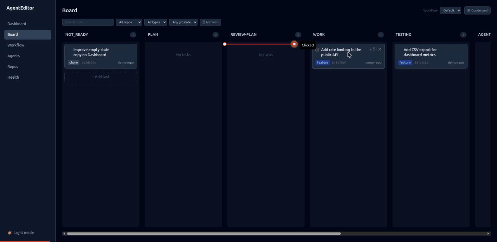
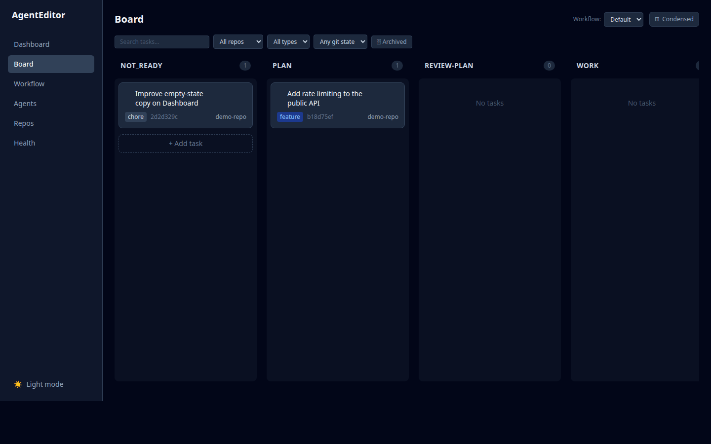
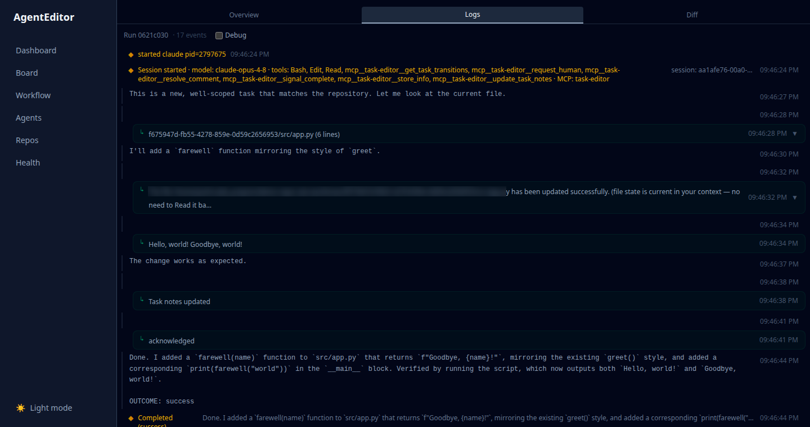
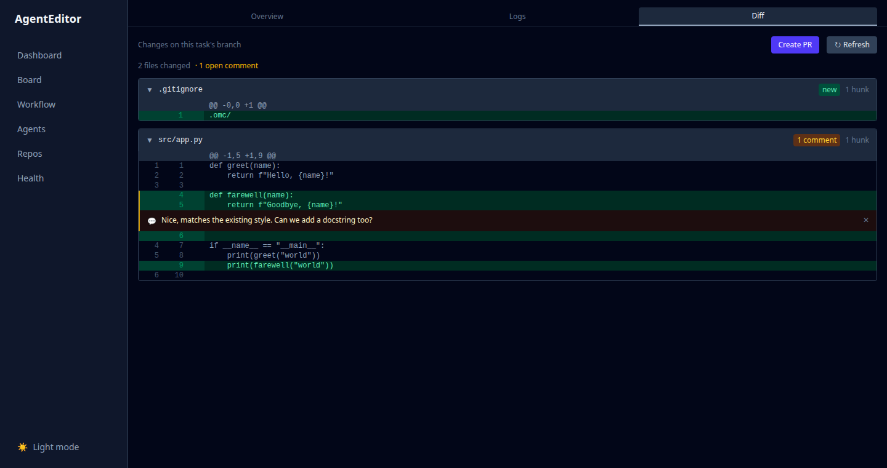
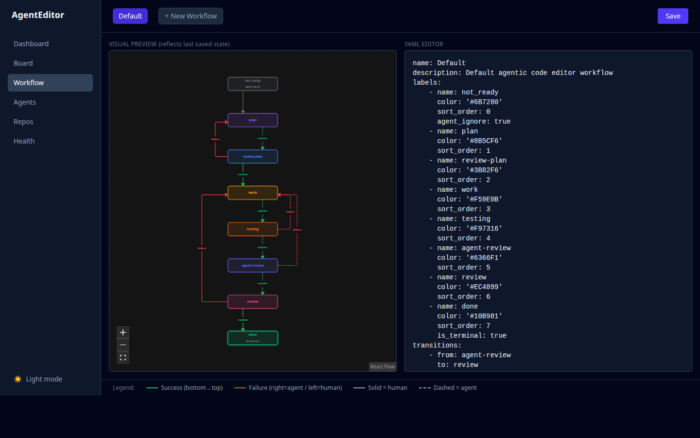
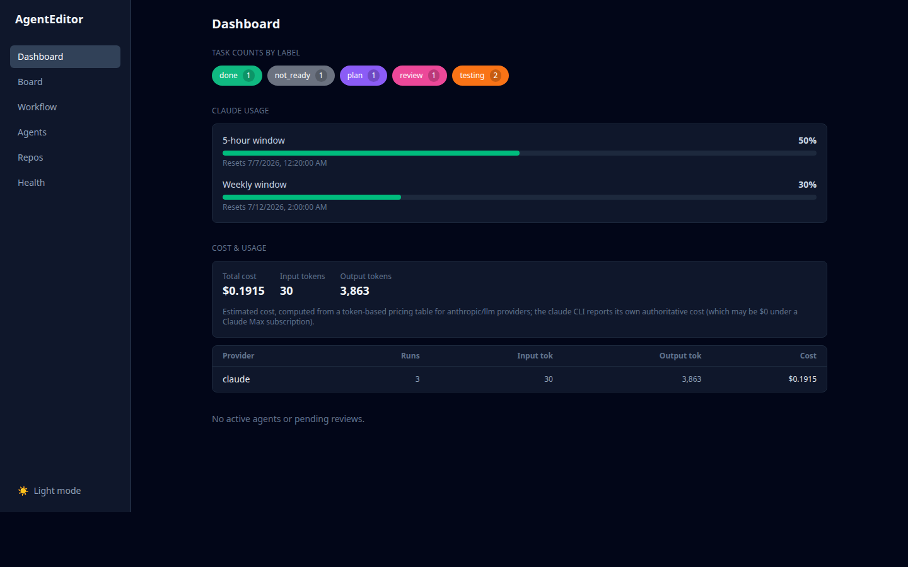
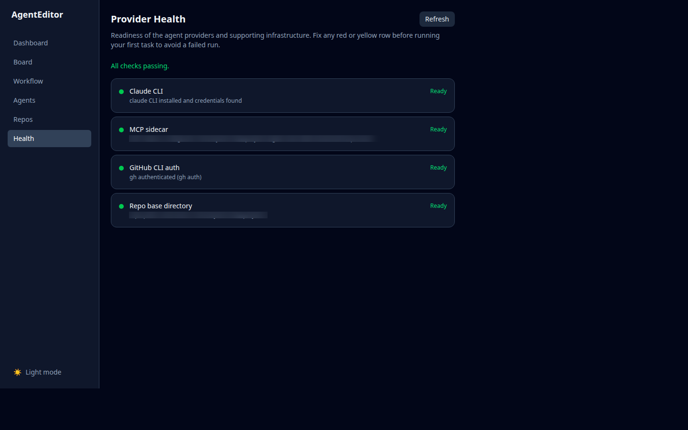

# Agent Task Editor

> A self-hosted Kanban board where AI agents automatically work through tasks as they move across workflow columns.

Agent Task Editor lets you define custom workflows, assign AI agents to specific columns, and have those agents automatically dispatch, run, and report back — all tracked against your code repositories. Think of it as a CI pipeline, but driven by LLMs instead of scripts, with a human-in-the-loop approval gate wherever you want one.

Each task moves through a directed state machine (the *workflow*). When a task lands on a label that an AI agent is configured to handle, the dispatcher picks it up within 5 seconds, creates a run record, streams live logs to the UI, and transitions the task to the next label when the agent signals it's done. Human-gated transitions require an explicit Approve or Reject click before the task moves on.



---

## Features at a Glance

- **Kanban board** with drag-and-drop between columns
- **Live log streaming** — agent stdout, tool calls, and tool results streamed in real time
- **Log replay** — reconnecting clients receive all prior logs for the current run
- **Per-task git worktrees** — concurrent agents on the same repo don't conflict
- **One-click PR URL** — pre-filled GitHub compare URL with task description and agent notes
- **Workflow editor** — create/edit labels, transitions, and trigger types; import/export YAML
- **Agent config UI** — manage multiple AI configs, each targeting different workflow stages
- **Git diff viewer** — per-task branch diff against the base ref
- **Session resume** — re-runs on the same task continue the agent's previous conversation (`claude --resume`) with full prior context instead of starting cold; per-agent-config opt-out for stages that want fresh eyes
- **Reply to a waiting agent** — when an agent asks for help (`request_human`), answer with text and it continues in the same session, without moving the task
- **Inline diff review comments** — leave file/line-anchored comments on the diff; open comments are injected into every agent run's prompt until the agent resolves them via the `resolve_comment` MCP tool
- **File upload attachments** — attach images to tasks; passed to the `claude` provider via `--image`
- **GitHub PR state sync** — auto-sync task git state with GitHub PR state; once a PR is detected as merged, the task's local branch and worktree are automatically cleaned up
- **GitHub Issues import** — per repo, opt-in: open issues (optionally filtered by a label) are periodically imported as tasks, and (opt-in, independently) status is written back to the source issue as the imported task progresses — a comment when its PR opens, an `agent-in-progress` label when it first leaves `not_ready`, and the issue closed with a comment when the PR merges — see [docs/task-sources.md](docs/task-sources.md)
- **Recurring task schedules** — turn a task template into a cron job: fire a pre-filled task against a repo on a schedule (hourly/daily/weekly presets or raw cron), skipping a firing while a prior unfinished task from the same schedule is still open; can target `not_ready` (human review) or a live agent label for fully unattended maintenance loops, pairing with cost budgets as a safety net — see [docs/task-templates.md](docs/task-templates.md)
- **Dashboard** — split into three focused pages: an Overview (label counts, active agents, and the human intervention queue), a Cost & Usage page (Claude rate-limit usage plus cost/token tracking by provider, day, and task), and an Agent Performance page (per-agent-config success rate, duration, retries)
- **Task priority** — low/normal/high/urgent priority per task; the dispatcher's pickup queue is ordered priority-first, then oldest-first, with an "N in queue" hint on cards waiting for a free worker
- **Provider health page** — readiness checks for the Claude CLI, MCP sidecar, GitHub auth, and repo base directory
- **Prometheus `/metrics` endpoint** — dispatcher/pool, run, cost/token, WebSocket, and GitHub-sync metrics, plus standard Go runtime metrics; independently gated by optional `METRICS_TOKEN`
- **Bearer token auth** — optional `API_TOKEN`, or multiple named tokens via `API_TOKENS` so human-triggered transitions record *who* approved them in the label history audit trail; WebSocket auth via short-lived, single-use tickets (`POST /ws-ticket`), with `?token=` kept as a deprecated fallback
- **Docker Compose deployment** — prebuilt multi-arch GHCR images; a single `./run.sh` to run everything
- **Installable as a PWA** — add the board to your phone's home screen for quick access

See [docs/overview.md](docs/overview.md) for the full concepts and architecture reference.

---

## Screenshots

| | |
|---|---|
| **Board** — drag-and-drop Kanban across workflow columns | **Task detail** — live agent logs as they stream in |
|  |  |
| **Diff viewer** — per-task diff with inline review comments | **Workflow editor** — visual + YAML, edit labels and transitions |
|  |  |
| **Dashboard overview** — label counts, active agents, and the intervention queue | **Health** — provider and infrastructure readiness checks |
|  |  |

---

## Quick Start

Run from prebuilt, multi-arch (amd64 + arm64) images — no Go/Node toolchain or
local build required:

```bash
git clone https://github.com/myinisjap/agent-task-editor
cd agent-task-editor
./run.sh                       # pulls ghcr.io/myinisjap/... :latest and starts the stack
# or pin a release:  ATE_VERSION=v0.1.0 ./run.sh
```

`run.sh` injects the runtime env vars for you (repo mount, GitHub token, Claude
auth, optional SSL bypass) and starts [`docker-compose.release.yml`](docker-compose.release.yml),
which references the published images:

- `ghcr.io/myinisjap/agent-task-editor-backend`
- `ghcr.io/myinisjap/agent-task-editor-frontend`

Prefer plain Compose? `ATE_VERSION=v0.1.0 docker compose -f docker-compose.release.yml up -d`.

Want the Gemini/Codex/Qwen CLIs preinstalled instead of building them yourself (see below)? Pass `--all-cli` to run the `-all-cli` backend image variant published alongside each release:

```bash
./run.sh --all-cli
```

Open **http://localhost:5173** in your browser.

> **Repo file ownership.** The backend container remaps its runtime user to your
> host user (`PUID`/`PGID`) at startup, so files agents write to bind-mounted
> repos are owned by you, not root. `run.sh` and `dev.sh` set these from
> `id -u`/`id -g` automatically; with plain Compose, export `PUID`/`PGID` or
> accept the `1000:1000` default. No rebuild needed.

Releases and their notes are on the
[Releases page](https://github.com/myinisjap/agent-task-editor/releases); see
[CHANGELOG.md](CHANGELOG.md) for the full history.

### Mount the Claude CLI (if using the `claude` provider)

The default `docker-compose.yml` shares your existing Claude auth with the container:

```yaml
volumes:
  - ${HOME}/.claude:/home/node/.claude   # auth credentials
```

The `claude` CLI binary itself is baked into the backend image — you don't need to mount it from the host. You do need to authenticate on your host machine (`claude login`) so the credentials are present at `~/.claude` before starting the stack.

### Build args: optional CLI providers, SSL verification

Unlike `claude` (installed unconditionally), the Gemini CLI (`gemini_cli` provider), Codex CLI (`codex_cli` provider), and Qwen CLI (`qwen_code` provider) are **not** installed in the default backend image — they're gated behind build args so the image doesn't grow for users who don't need them:

```bash
INSTALL_GEMINI_CLI=true INSTALL_CODEX_CLI=true INSTALL_QWEN_CLI=true docker compose build
```

Running from prebuilt images instead of building locally? Every release also publishes a backend image with all three CLIs preinstalled, tagged with an `-all-cli` suffix (e.g. `ghcr.io/myinisjap/agent-task-editor-backend:latest-all-cli`). Run it with `./run.sh --all-cli`, or set `ATE_CLI_SUFFIX=-all-cli` if you're driving `docker-compose.release.yml` directly.

`INSECURE_SKIP_SSL_VERIFY=true` is also available (see `backend/Dockerfile`) to disable SSL verification for git/npm/Node.js behind a corporate TLS proxy. See [docs/providers/gemini_cli.md](docs/providers/gemini_cli.md), [docs/providers/codex_cli.md](docs/providers/codex_cli.md), and [docs/providers/qwen_code.md](docs/providers/qwen_code.md) for authentication setup once installed.

### Mount your repositories

Agents run with their working directory set to the registered repo path. Add a volume for the projects you want agents to access:

```yaml
volumes:
  - /path/to/your/projects:/repos:rw
```

Then set `REPO_BASE_DIR=/repos` in the backend environment to prevent agents from accessing paths outside that subtree.

See [docs/getting-started.md](docs/getting-started.md) for the full setup guide, all environment variables, and local development instructions.

---

## First Steps After Startup

1. **Register a repository** — Settings → Repos → Add Repo. Enter the local filesystem path agents should work in.
2. **Create an agent config** — Settings → Agents → New Agent. Select a provider, enter a model, set target labels (e.g. `["plan", "work"]`), and optionally write a system prompt.
3. **Create a task** — Board → New Task. Select the repo and fill in the title and description.
4. **Move it to `plan`** — drag it or use the label selector. The dispatcher picks it up within 5 seconds.
5. **Watch the logs** — click the task to open the detail view; logs stream live as the agent works.

---

## Agent Provider Comparison

Seven providers are available. Choose based on your auth setup, billing preference, and tool requirements.

| Provider | Auth Required | CLI Dependency | Built-in Tools | Label Transitions | Notes |
|---|---|---|---|---|---|
| **`claude`** | Claude Max subscription (authenticated via `~/.claude`) | ✅ `claude` CLI must be installed & authenticated on the host/container | `Edit`, `Write`, `Read`, `Bash`, `Glob`, `Grep` + MCP tools | ✅ via MCP sidecar (`MCP_SERVER_PATH` must be set) | Without MCP, runs always complete with no label transition. Dangerous env vars (`PATH`, `LD_PRELOAD`, `HOME`, `SHELL`, etc.) are blocked for security. |
| **`anthropic`** | Anthropic API key (`LLM_API_KEY`) | ❌ No CLI needed | `read_file`, `write_file`, `run_bash`, `signal_complete`, `request_human` | ✅ Built-in (no MCP needed) | Billed per-token — separate from a Claude Max subscription. No `Glob`/`Grep` tools. |
| **`llm`** | API key (`LLM_API_KEY`) + `LLM_BASE_URL` | ❌ No CLI needed | `read_file`, `write_file`, `run_bash`, `signal_complete`, `request_human` | ✅ Built-in (no MCP needed) | Works with OpenAI, Azure OpenAI, Ollama, LM Studio, and any OpenAI-compatible endpoint. Same tool set as `anthropic`. Output quality varies by model/endpoint. |
| **`opencode`** | Provider-specific (configured in `opencode` CLI) | ✅ `opencode` binary must be installed | Depends on opencode config | ❌ MCP tools not available | Label transitions require MCP, which opencode does not support. Runs complete without transitioning the task label. |
| **`qwen_code`** | Qwen auth (configured in `qwen` CLI) | ✅ `qwen` binary must be installed (see `INSTALL_QWEN_CLI` build arg) | `Edit`, `Write`, `Read`, `Bash`, `Glob`, `Grep` + MCP tools | ✅ via MCP sidecar (`MCP_SERVER_PATH` must be set) | Same MCP setup as the `claude` provider. |
| **`gemini_cli`** | Google account login or `GEMINI_API_KEY`/`GOOGLE_API_KEY` | ✅ `gemini` CLI must be installed (see `INSTALL_GEMINI_CLI` build arg) | Gemini's built-in tools + MCP tools | ✅ via MCP sidecar (`MCP_SERVER_PATH` must be set) | MCP wired via a per-run isolated `GEMINI_CLI_HOME`, not a CLI flag. No cost figure reported (token counts only). Command allowlist/denylist not enforced. |
| **`codex_cli`** | ChatGPT account login (`codex login`) or `OPENAI_API_KEY` | ✅ `codex` CLI must be installed (see `INSTALL_CODEX_CLI` build arg) | Codex's built-in tools + MCP tools | ✅ via MCP sidecar (`MCP_SERVER_PATH` must be set) | MCP wired via a per-run isolated `CODEX_HOME`, not a CLI flag. Runs fully unsandboxed/unattended (`--dangerously-bypass-approvals-and-sandbox`); command allowlist/denylist not enforced — Codex's own sandbox/approval system is bypassed instead. No cost figure reported (token counts only). |

### Key limitations to be aware of

- **`claude` without MCP** — If `MCP_SERVER_PATH` is not set, the agent has no way to call `signal_complete` or `request_human`. Every run will finish with status `completed` but the task label will **not** change. Always build and configure the MCP sidecar when using the `claude` provider.
- **`claude` env var restrictions** — The `env` field in agent configs cannot override system-critical variables (`PATH`, `LD_PRELOAD`, `HOME`, `SHELL`, and others). Attempts are blocked and logged as warnings.
- **`llm` model quality** — The `llm` provider sends the same tool definitions and prompts regardless of endpoint, but smaller or instruction-tuned models may not reliably follow tool-use conventions. Test your chosen model before relying on it for automated workflows.

---

## Supported Languages

Agent shell commands run inside the **backend** Docker container, against your bind-mounted repos — so the languages agents can build/test are whatever's installed in `backend/Dockerfile`'s runtime image. Out of the box that's **Go 1.26** and **Node.js 26 / npm** (covering Vite/React/TypeScript projects), plus `git`, `gh`, `bash`, and `build-base` for cgo/native-module compilation. To add another language/compiler (Python, Rust, Java, Ruby, etc.), edit the final stage of `backend/Dockerfile` and rebuild — see [docs/getting-started.md](docs/getting-started.md#supported-languages--extending-the-toolchain) for step-by-step instructions and caveats.

---

## Security

> **This tool executes arbitrary shell commands by design.** AI agents run `Bash` (claude provider) or `run_bash` (anthropic/llm providers) with full shell access as the server user. The security boundary is the container and the `REPO_BASE_DIR` mount — not the application itself.

**Default settings are for localhost only.** Before exposing this to any non-localhost network:

- [ ] Set `API_TOKEN` (or `API_TOKENS` for named, per-actor tokens — recommended so approvals are attributable in the audit trail) — without it, anyone who can reach port 8080 can create repos, dispatch agents, and run shell commands
- [ ] Set `REPO_BASE_DIR` — without it, agents can be pointed at any path on the host
- [ ] Set `CORS_ORIGINS` to your actual origin instead of `*`
- [ ] Run behind a reverse proxy or VPN; do not expose port 8080 directly to the internet

The server binds to all interfaces (`:8080`) by default. In Docker, map it to `127.0.0.1:8080` if you don't need external access.

---

## Key Environment Variables

| Variable | Default | Description |
|---|---|---|
| `API_TOKEN` | _(empty)_ | Bearer token for API auth; empty = no auth required |
| `API_TOKENS` | _(empty)_ | Named bearer tokens (`name1:token1,name2:token2`) — resolves to an actor name recorded in the label history audit trail; see [docs/getting-started.md](docs/getting-started.md#authentication) |
| `METRICS_TOKEN` | _(empty)_ | Bearer token gating `GET /metrics` independently of `API_TOKEN`; empty = unauthenticated |
| `REPO_BASE_DIR` | _(empty)_ | Restrict repo registration to paths under this directory |
| `MCP_SERVER_PATH` | _(empty)_ | Path to the `mcp-server` binary; required for label transitions with the `claude` provider |
| `LLM_API_KEY` | _(empty)_ | API key for the `anthropic` or `llm` provider |
| `LLM_BASE_URL` | `https://api.openai.com/v1` | Base URL for the `llm` (OpenAI-compatible) provider |
| `MAX_WORKERS` | `5` | Maximum number of concurrent agent runs |

See [docs/getting-started.md](docs/getting-started.md) for the full variable reference.

---

## Local Development

The fastest path is the dev helper script:

```bash
./dev.sh dev   # starts backend + frontend + builds the MCP sidecar
```

Or run services individually:

```bash
# Backend (Go 1.24+)
cd backend && go run ./cmd/server

# Frontend (Node 20+)
cd frontend && npm install && npm run dev

# MCP sidecar (needed for claude provider label transitions)
cd backend && go build -o mcp-server ./cmd/mcp-server
```

---

## Documentation

| Doc | Description |
|---|---|
| [docs/overview.md](docs/overview.md) | Core concepts, architecture diagram, default workflow |
| [docs/getting-started.md](docs/getting-started.md) | Installation, environment variables, local dev setup |
| [docs/workflows.md](docs/workflows.md) | State machine format, labels, transitions, YAML import/export |
| [docs/agents.md](docs/agents.md) | Providers, dispatcher, worker pool, run lifecycle, prompt construction |
| [docs/task-sources.md](docs/task-sources.md) | Importing GitHub Issues as tasks |
| [docs/task-templates.md](docs/task-templates.md) | Task templates and recurring cron-scheduled task creation |
| [docs/api.md](docs/api.md) | Full REST API endpoint reference |
| [docs/websocket.md](docs/websocket.md) | Live log streaming WebSocket protocol |
| [docs/screenshots.md](docs/screenshots.md) | How to regenerate the README/docs screenshots and hero GIF |

---

## License

MIT — see [LICENSE](LICENSE).
